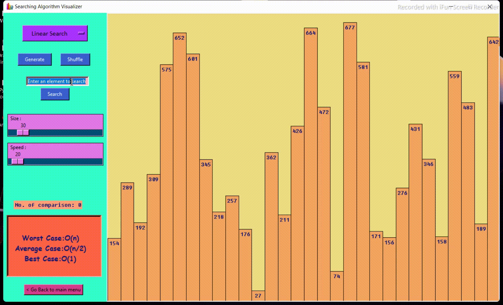
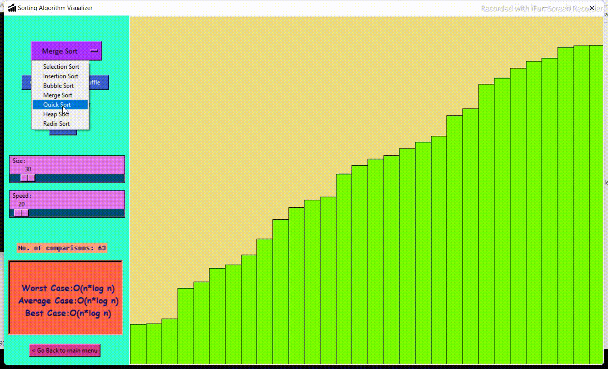
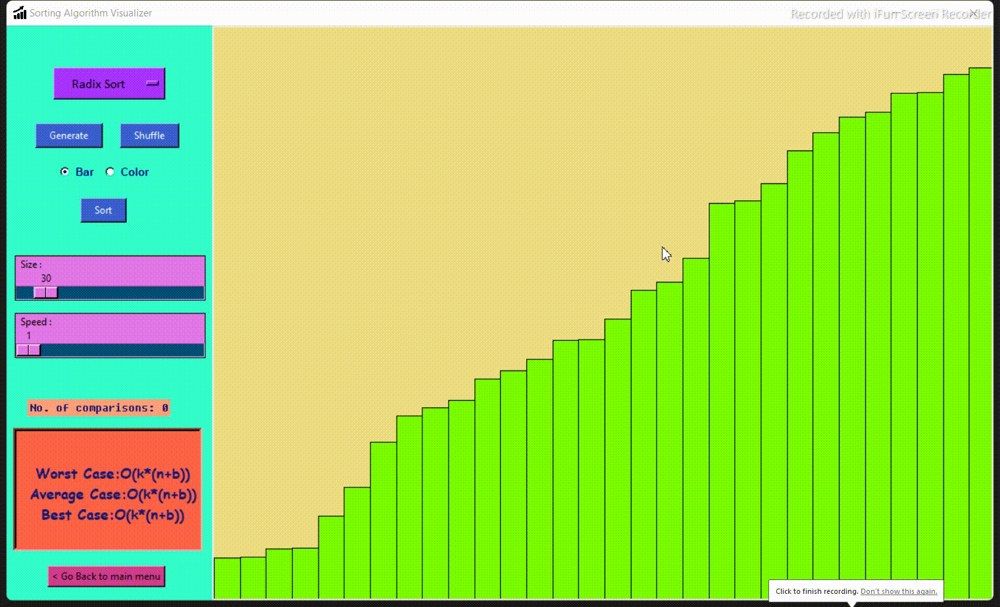

    

 

  
  <h1 align="center">Algorithm Visualizer</h1>
  

    <i><b>A desktop app made using Tkinter and Pygame modules of Python to visualize different computer algorithms like searching and sorting.</b></i> 
    The main motive of this project is to help beginners understand the basic concepts of common algorithms.
  

## Algorithm Contents
- **Searching Algorithms**
  - Linear Search
  - Binary Search
- **Sorting Algorithms**
  - Selection Sort
  - Insertion Sort
  - Bubble Sort
  - Merge Sort
  - Quick Sort
  - Heap Sort
  - Radix Sort

## Main Window
The main window features two dropdown menus for selecting the Algorithm Type and the Algorithm Name to visualize. Initially, the Algorithm Name menu is set to "None," but once an Algorithm Type is selected, the menu automatically updates with the relevant algorithms. A "Next" button directs you to a new window corresponding to the selected algorithm. An exit warning is provided to confirm whether you truly wish to close the application.

## Searching Algorithms
The Searching Algorithm Visualizer window allows users to switch between searching algorithms without returning to the main window. Users can generate and shuffle the array, enter the element value to search, and start the search operation. Sliders control the array size and visualization speed. Labels display the number of comparisons and the result of the search. An algorithm info section provides time complexity details. The interface includes a back button to return to the main menu. The searching is visualized using bar graphs, with already checked elements marked in red and the found element (if any) in green.

#### &nbsp;&nbsp;&nbsp;&nbsp;Linear Search
&nbsp;&nbsp;&nbsp;&nbsp; 
#### &nbsp;&nbsp;&nbsp;&nbsp;Binary Search
&nbsp;&nbsp;&nbsp;&nbsp; 

## Sorting Algorithms
The Sorting Algorithm Visualizer window allows users to switch between sorting algorithms without returning to the main window. Users can generate and shuffle the array and choose between two visualization types: bar graphs or color bars. Sliders control the array size and visualization speed. Labels display the number of comparisons after each operation. An algorithm info section provides time complexity details. The interface includes a back button to return to the main menu. Once sorting is complete, the entire array (bars) is painted green.

#### &nbsp;&nbsp;&nbsp;&nbsp;Sorting Algorithm Visualizer Interface
&nbsp;&nbsp;&nbsp;&nbsp; 
#### &nbsp;&nbsp;&nbsp;&nbsp;Selection Sort
&nbsp;&nbsp;&nbsp;&nbsp; 
#### &nbsp;&nbsp;&nbsp;&nbsp;Insertion Sort
&nbsp;&nbsp;&nbsp;&nbsp; 
#### &nbsp;&nbsp;&nbsp;&nbsp;Bubble Sort
&nbsp;&nbsp;&nbsp;&nbsp; 
#### &nbsp;&nbsp;&nbsp;&nbsp;Merge Sort
&nbsp;&nbsp;&nbsp;&nbsp; 
#### &nbsp;&nbsp;&nbsp;&nbsp;Quick Sort
&nbsp;&nbsp;&nbsp;&nbsp; 
#### &nbsp;&nbsp;&nbsp;&nbsp;Heap Sort
&nbsp;&nbsp;&nbsp;&nbsp; 
#### &nbsp;&nbsp;&nbsp;&nbsp;Radix Sort
&nbsp;&nbsp;&nbsp;&nbsp; 

## Requirements/Steps to run 
  * Install [*__Python__*](https://www.python.org/downloads/)
  * Install [*__Pygame Module__*](https://www.pygame.org/wiki/GettingStarted)
  * Run Algorithm_Visualizer (main).py

All the best!
